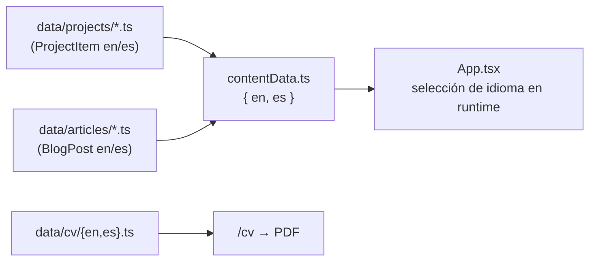
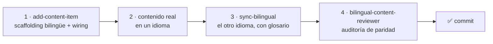

<div align="center">


# Portfolio personal

**SPA bilingüe (EN/ES) con case studies, blog técnico, CV imprimible y actividad de GitHub en vivo**

🌐 **[portfolio.nicolasbarcelo.dev](https://portfolio.nicolasbarcelo.dev)**


</div>

---

## ✨ Qué hay dentro

| | |
|---|---|
| 🗂️ **Case studies** | Proyectos con schema extendido: problema, solución, métricas reales, tech stack y lecciones aprendidas |
| ✍️ **Blog técnico** | Artículos bilingües en HTML con paridad estructural EN/ES auditada |
| 🌗 **Dark mode** | Vía clase `dark` en `<html>` y variantes `dark:` de Tailwind |
| 📄 **CV imprimible** | Renderizado en `/cv` desde datos versionados y exportado a PDF |
| 📡 **Actividad en vivo** | Ticker "Currently building" regenerado por GitHub Actions cada 6 h |
| 🌍 **Bilingüe real** | Dos `AppContent` completos (`en` / `es`) seleccionados en runtime |

## 🧱 Stack

- **React 19** + **React Router 7** para la SPA
- **TypeScript** estricto
- **Vite 6** como build tool (alias `@` apunta a la raíz)
- **Tailwind CSS v4** vía PostCSS
- **GitHub Actions** para regenerar `public/activity.json` cada 6 h

## 🚀 Comandos

| Comando | Qué hace |
|---|---|
| `npm install` | Instalar dependencias |
| `npm run dev` | Servidor de desarrollo en `http://localhost:3000` |
| `npm run build` | Build de producción a `dist/` |
| `npm run preview` | Previsualizar el build de producción |
| `npm run typecheck` | `tsc --noEmit` (mismo comando que corre el hook) |

> No hay tests ni linting configurados; `typecheck` es el único guardrail formal.

## 🗂️ Arquitectura del contenido

Todo el contenido vive en `contentData.ts`, que exporta `{ en, es }` — dos `AppContent` completos. El idioma activo se selecciona en runtime y se pasa como `data` por toda la app.

Proyectos y artículos se definen como pares bilingües `{ en, es }` en ficheros separados y se ensamblan en `contentData.ts`. Las interfaces TypeScript están en `types.ts`.



### ➕ Añadir un proyecto o artículo

Flujo con los skills de Claude Code incluidos en `.claude/skills/`:



> **Regla de oro**: el contenido del portfolio (proyectos, métricas, posts) siempre es real, nunca inventado.

## 📄 CV imprimible

El CV se renderiza en `/cv` desde `data/cv/{en,es}.ts` mediante `components/CVView.tsx`. Para regenerar los PDF:

1. Abrir `/cv` en el navegador
2. Cambiar idioma con el toggle del header
3. `Ctrl+P` → Save as PDF, A4, **"Background graphics" activado**
4. Guardar como `public/cv-en.pdf` o `public/cv-es.pdf`

El botón "Download CV" en `HomeView` enlaza a `/cv-${language}.pdf`.

## 📡 Ticker de actividad

`components/ActivityTicker.tsx` consume `public/activity.json`, regenerado por GitHub Actions:

- **Workflow**: `.github/workflows/update-activity.yml`
- **Cron**: cada 6 horas (`0 */6 * * *`)
- Hace fetch de los commits públicos recientes y commitea el JSON solo si ha cambiado

Así el navegador del visitante nunca llama a la API de GitHub — cero rate limits, cero exposición.

## ✅ Quality gate

`.claude/hooks/tsc-on-edit.sh` corre `tsc --noEmit` tras cada edición de `.ts`/`.tsx` desde Claude Code y bloquea si aparecen errores.

## 🔀 Despliegue

Despliegue continuo vía **Dokploy** (self-hosted) desde la rama `production`:

```bash
git checkout production
git merge --ff-only main
git push
```

Dokploy detecta el push, hace build y sirve el `dist/` resultante en `portfolio.nicolasbarcelo.dev`.

## 📁 Estructura

```
.
├── App.tsx                  # layout + router
├── contentData.ts           # ensamblado bilingüe { en, es }
├── types.ts                 # interfaces (AppContent, ProjectItem, BlogPost, …)
├── components/              # vistas y UI
├── data/projects/           # un fichero por proyecto (par bilingüe)
├── data/articles/           # un fichero por artículo (par bilingüe)
├── data/cv/                 # contenido del CV por idioma
├── hooks/                   # custom React hooks
├── public/                  # estáticos: activity.json, cv-{en,es}.pdf, profile.png
├── .claude/                 # hooks y skills locales del proyecto
└── .github/workflows/       # automatizaciones (ticker de actividad)
```

---

<div align="center">

Hecho con React y Tailwind · Contenido 100 % real · [nicolasbarcelo.dev](https://portfolio.nicolasbarcelo.dev)

</div>
